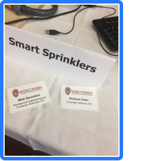
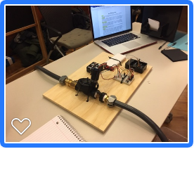

# SmartSprinkler (WaterMe.IoT)
The Controller of the Smart sprinkler project (Application side)
Python scripts controls ResberryPi.
Using AWS(Potentially) connecting webservice and the physical device.
	
Alternatively, we also have a socket connection 

	Ref: http://studyraspberrypi.blogspot.com/2016/03/sending-rsa-encrypted-message-ios.html
## History:

  During the poster session in Dec 2016, the sprinkler prototype can control the water flow based on user's input
  However, users can only access the sprinkler via Linux computer instead of mobile devices.
	
In Spring 2017 Richard Chen & Matt Saunders decided to continue this project as the independent research project. 

 

## How it works:
The iOS program can connect to the physical device(a Raspberry Pi 3) via AWS IoT services;

It also has a controller which can check the local precipitation data and adjust the water flow base on the data
When the user click start sprinking button, it will set up a connection to the Pi and start watering the plant!
 
